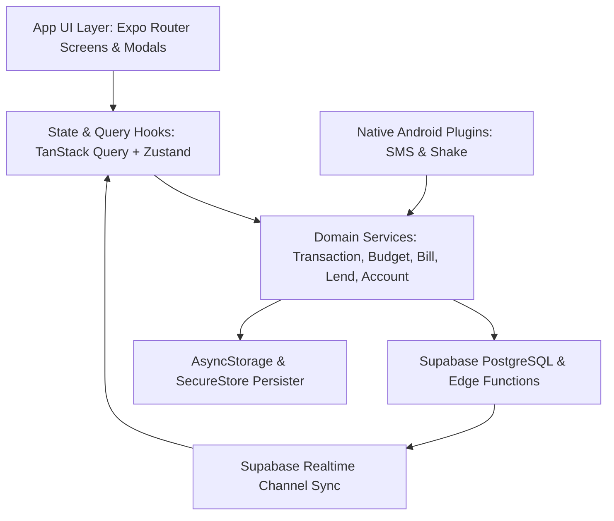

# Architecture & Design Patterns

## Architectural Overview
PocketWise is organized into four distinct architectural layers:

1. **Presentation & Screen Layer (`app/`, `components/`):**
   - File-based routing with Expo Router (`app/_layout.tsx`, `app/(tabs)/`, `app/(auth)/`, and dedicated full-screen modals/sub-routes).
   - Custom animated gesture-based tab navigation (`app/(tabs)/_layout.tsx`) utilizing Reanimated 4 and Gesture Handler for snappy swipe transitions.
   - Screen-agnostic overlay architecture: Quick Expense modal and Lock Screen Gate sit above the navigation stack.

2. **Domain Service Layer (`lib/services/`, `lib/finance/`, `lib/notifications/`, `lib/sms/`, `lib/shake/`):**
   - Clean domain services (`transactionService`, `accountService`, `billService`, `goalService`, `budgetService`, `lendService`, `notificationService`, `shakeService`).
   - Integer minor-unit currency calculation (`amount_minor` in paise) in `lib/finance/core.ts` preventing floating-point rounding errors.

3. **Data & Synchronization Layer (`lib/supabase.ts`, TanStack Query):**
   - TanStack React Query handles caching, stale-while-revalidate, deduplication, and automatic invalidation on mutations.
   - `PersistQueryClientProvider` persists query cache for 7 days in AsyncStorage.
   - `GlobalRealtimeSync` listens to PostgreSQL change streams via Supabase Realtime channel, invalidating TanStack Query keys instantly on remote changes.

4. **Native Extensibility Layer (`plugins/`):**
   - Custom Expo Config Plugins inject native Java/Kotlin Android BroadcastReceivers, Foreground Services, and system alert windows for SMS tracking and Shake detection without requiring bare manual Android modifications.
