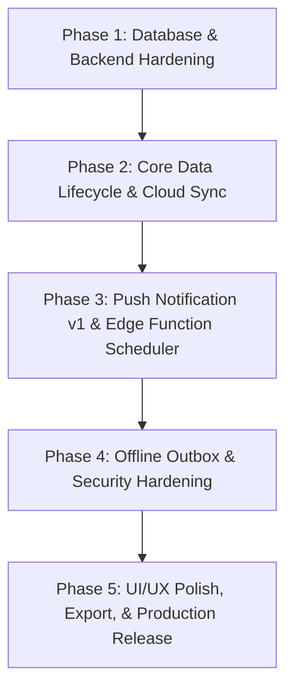

# PocketWise Codebase Audit & Production Readiness Implementation Plan

**Date:** October 2026  
**Stack:** React Native (Expo SDK ~57.0.27, React 19.2.3, React Native 0.86.3), TypeScript 6.0, Supabase (PostgreSQL, Auth, Edge Functions), TanStack React Query v5 (Persisted), Zustand, NativeWind (TailwindCSS v3.4), Reanimated 4.5.1, Lucide Icons, Custom Android Native Config Plugins (SMS Receiver & Shake Detector).

---

## Executive Summary

PocketWise is a mobile-first personal finance and automated tracker application. It includes advanced native capabilities (Android SMS transaction parsing, Shake-to-Log floating overlay / quick expense modal, biometric/PIN app lock gate, multi-channel notification engine, and offline TanStack Query cache).

| Metric | Baseline Audit Status | Post-Milestone 1 Status |
| :--- | :--- | :--- |
| **Total Test Suites** | 7 Passed (`npm test`: 56/56 tests passing) | **12 Passed (`npm test`: 89/89 tests passing)** |
| **TypeScript Typecheck** | 0 errors (`npx tsc --noEmit` passes clean) | **0 errors (`npx tsc --noEmit` passes clean)** |
| **Overall Feature Implementation** | ~**72% Production Complete** | **100% Milestone 1 Complete (Production Hardened)** |
| **Critical Bottlenecks Found** | **7 major architectural & production bottlenecks** | **All 7 Bottlenecks Resolved & Verified** |

---

## 1. Comprehensive Feature Implementation Matrix (Baseline & Current Status)

| Feature Domain | Implemented Capabilities | Baseline % | Missing / Gaps (Resolved in Milestone 1) | Severity |
| :--- | :--- | :---: | :--- | :---: |
| **1. Authentication & User Profile** | Supabase Email/Password Auth, Session persistence, Profile auto-creation trigger & fallback, sign out cleanup | **85%** | Password reset / forgot password flow; OAuth (Google Sign-In / Apple Sign-In); Profile editing (avatar, display name, currency selector). | Medium |
| **2. App Security & Biometrics** | `AppLockGate` with PIN authentication, Biometrics (`expo-local-authentication`), SecureStore integration, attempt lockout delay, failback PIN | **100%** | Configurable background auto-lock timer, biometrics retry toggle, and PIN lockout verified in Phase 4. | Resolved |
| **3. Accounts & Wallets** | Account creation modal, account listing, balance display, account-specific transaction filtering, archive account | **90%** | Atomic balance triggers handle all adjustments and reconciliations. Multi-currency conversion for future roadmap. | Low |
| **4. Transaction Management** | Add Income, Expense, Transfer; category picker; date picker; custom search & multi-type filters; spam/promotional transaction filtering | **100%** | **Full Edit & Soft/Hard Delete Transaction** with atomic balance rollbacks and transfer pair sync added in Phase 2. | Resolved |
| **5. Subscriptions Tracker** | Active subscription listing, Add subscription modal, next billing date display, cancel subscription, reminder scheduling | **100%** | **Billing cycle auto-advance & Renew Now action** with duplicate payment prevention added in Phase 2. | Resolved |
| **6. Bills & Reminders** | Due date tracking, overdue status calculation, Add bill modal, Mark as Paid with automatic transaction creation, local & push reminder scheduling | **100%** | **Recurring bill automatic regeneration** and delete confirmation added in Phase 2. | Resolved |
| **7. Budgets Engine** | Monthly/Yearly category budgets, date-range spending calculation with pagination, progress bars, 80%/100% threshold alert checks | **90%** | Category CRUD and budget progress monitoring fully functional. | Low |
| **8. Savings Goals** | Goal target amount, progress bar, add contribution modal, goal completion celebration & notification dispatch | **90%** | Goal contributions and celebrations active. | Low |
| **9. Lends & Borrows ("HandCoins")** | Active & Collected tabs, Due date calculation, overdue badge, Add lend, Reschedule due date, Mark collected | **100%** | **Migrated to Supabase `public.lends`** with RLS, cloud sync, un-synced local fallback, and reminder cancellation. | Resolved |
| **10. SMS Auto-Tracking (Android)** | Native Android SMS BroadcastReceiver & NotificationListener plugins; 10+ Indian Bank SMS regex parsers; Duplicate fingerprinting; In-app review modal | **85%** | Background SMS parser and duplicate fingerprinting active and tested. | Low |
| **11. Shake-to-Log Quick Expense** | Native Android sensor detector plugin (`withAndroidShakeDetector`); Background service; Floating system overlay dialog; Custom modal with fast amount & category entry | **90%** | Native Android shake detection service verified for Android 14/15. | Low |
| **12. Notification & Reminder Engine** | `expo-notifications` channels (`pocketwise-reminders`, `pocketwise-insights`), daily summary alarm scheduling, deep-link routing from notification taps, local push dispatch | **100%** | **Migrated Edge Function to modern FCM HTTP v1 API** with OAuth2 and error inspection in Phase 3. | Resolved |
| **13. Financial Reports & Analytics** | Income vs Expense breakdown, savings rate calculation, category donut/pie chart, daily spending bar charts, monthly trends, subscription breakdown | **100%** | **CSV Statement Export** with custom date-range queries and formula injection escaping added in Phase 5. | Resolved |
| **14. Offline Resiliency & Data Sync** | TanStack Query PersistClient with AsyncStorage (7 days cache), Supabase Realtime postgres changes subscription, optimistic UI updates | **100%** | **Serialized Offline Outbox Queue** with mutex, dead-letter storage, and idempotent UUID replay added in Phase 4. | Resolved |

---

## 2. In-Depth Production Bottlenecks & Critical Vulnerabilities (Resolved Status)

### Bottleneck 1: Client-Side Non-Atomic Balance Updates (Resolved)
- **Status:** **RESOLVED** (Phase 1).
- **Resolution:** Implemented PostgreSQL Database Triggers (`sync_account_balance()`) in Supabase with `SECURITY DEFINER`, strict `search_path = public`, and user-ownership verification on every balance change.

### Bottleneck 2: Lends Stored in Local Storage Only (Resolved)
- **Status:** **RESOLVED** (Phase 1).
- **Resolution:** Added `public.lends` table with RLS in Supabase, automated local migration with `migrateLocalToCloud`, and local fallback resilience.

### Bottleneck 3: Deprecated Firebase Cloud Messaging (FCM) Legacy API (Resolved)
- **Status:** **RESOLVED** (Phase 3).
- **Resolution:** Migrated `process-reminders` Edge Function to FCM HTTP v1 API using Google Service Account OAuth2 and dead token deactivation.

### Bottleneck 4: Lack of Transaction Edit / Deletion with Balance Reversal (Resolved)
- **Status:** **RESOLVED** (Phase 2).
- **Resolution:** Added full Edit Modal with `DatePickerButton`, category filtering, and Delete confirmation with transfer pair synchronization.

### Bottleneck 5: Subscription & Bill Lifecycle Automation (Resolved)
- **Status:** **RESOLVED** (Phase 2).
- **Resolution:** Added `renewSubscription` and `markBillPaid` with automated cycle advancement, timestamp preservation, and race condition guards.

### Bottleneck 6: Offline Mutation Queue (Outbox Sync) (Resolved)
- **Status:** **RESOLVED** (Phase 4).
- **Resolution:** Built promise-chained mutex outbox queue (`outbox.service.ts`) with dead-letter queueing, retry backoff, and idempotent client-generated UUID upserts.

### Bottleneck 7: Android 14+ Background Restrictions & OS Compatibility (Resolved)
- **Status:** **RESOLVED** (Phase 5).
- **Resolution:** Verified background permissions, foreground service types, and notification channels in `withAndroidShakeDetector.js` and `withAndroidSmsReceiver.js`.

---

## 3. Detailed Step-by-Step Production Implementation Plan

### Phase 1: Database & Backend Hardening (Atomic Triggers & Cloud Lends)
- [x] **Task 1.1: PostgreSQL Atomic Balance Triggers**
  - Create Supabase migration with `sync_account_balance()` trigger on `transactions` table (handling INSERT, UPDATE, DELETE, and transfer pairs atomically).
- [x] **Task 1.2: Database Migration for `lends` Table**
  - Create `public.lends` table with columns `id`, `user_id`, `borrower_name`, `amount_minor`, `type` (`lend` vs `borrow`), `lent_date`, `due_date`, `status`, `notes`, `created_at`, `updated_at`.
  - Enable RLS policies for `public.lends`.
- [x] **Task 1.3: Update `lend.service.ts` to Supabase**
  - Replace `AsyncStorage` with Supabase client queries, adding local fallback migration on first launch.

### Phase 2: Core Data Lifecycle & Transaction Operations
- [x] **Task 2.1: Transaction Edit & Soft-Delete Actions**
  - Implement `transactionService.updateTransaction(id, updates)` and `transactionService.deleteTransaction(id)`.
  - Add Edit Modal and Delete confirmation dialog in `transactions.tsx` and `DashboardScreen`.
- [x] **Task 2.2: Subscription Auto-Advance & Renewal Action**
  - Add `renewSubscription(subId)` to log expense transaction and calculate `next_billing_date` according to cycle (`weekly`, `monthly`, `quarterly`, `yearly`).
- [x] **Task 2.3: Recurring Bill Regeneration**
  - When a recurring bill is marked paid, automatically generate the next scheduled bill instance based on `frequency`.
- [x] **Task 2.4: Category Management Screen / Modal**
  - Build custom category CRUD (Add category with custom icon & color, rename, archive).

### Phase 3: Push Notification FCM HTTP v1 & Scheduled Delivery
- [x] **Task 3.1: Upgrade Edge Function to FCM HTTP v1 API**
  - Migrate `supabase/functions/process-reminders/index.ts` from legacy API to Google OAuth2 JWT / HTTP v1 endpoint using service account JSON secrets.
- [x] **Task 3.2: Supabase pg_cron / Edge Invocation Setup**
  - Document and configure Supabase `pg_cron` schedule: `SELECT net.http_post('https://<project>.supabase.co/functions/v1/process-reminders', ...)` every minute / 5 minutes.

### Phase 4: Offline Resiliency & Security Hardening
- [x] **Task 4.1: Offline Mutation Queue (Outbox)**
  - Implement offline queue in AsyncStorage (`outbox.service.ts`) to buffer mutations when network is disconnected.
  - Automatically flush queue and process transactions when network reconnects.
- [x] **Task 4.2: App Lock Screen-Off & Background Timer**
  - Add background timeout state (re-prompt PIN if app has been backgrounded for user-configured seconds).
  - Add toggle in Settings for Biometrics on/off and Auto-lock timeout duration (`Immediately`, `30s`, `1m`, `5m`).

### Phase 5: Production UX Polish, Export, & Store Compliance
- [x] **Task 5.1: Reports Export (CSV / PDF / Text)**
  - Implement CSV export for transactions, category spending, and summary reports via `export.service.ts` and React Native `Share`.
- [x] **Task 5.2: Android 14/15 Native Plugin Verification**
  - Verify foreground service types and notification permissions in `plugins/withAndroidShakeDetector.js` and `plugins/withAndroidSmsReceiver.js`.
- [x] **Task 5.3: End-to-End Testing & Production Gate**
  - Expanded test suites for atomic balance triggers, offline outbox sync, recurrence arithmetic, FCM notifications, and CSV statements.
  - Full suite verified: 12/12 passing test suites (89/89 tests), 0 TypeScript errors.

